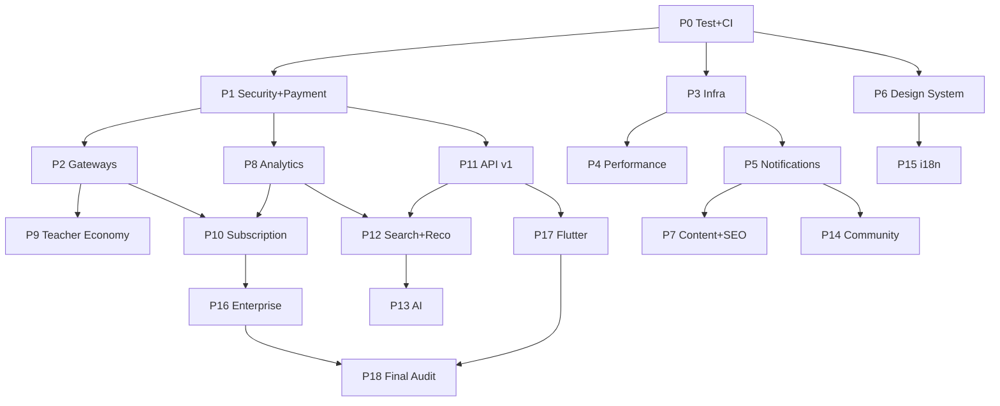

# Taallum BD Master Plan (Part 1–30): বাস্তবায়ন প্ল্যান

## লক্ষ্য
[Taallum_BD_Master_Plan_Part_1_to_30.md](file:///c:/Users/USER/Downloads/antigravity/Taallum-New-Website/Taallum_BD_Master_Plan_Part_1_to_30.md)-এর ৩০টি পার্টকে কাজ করার উপযোগী **১৯টি ফেজে (Phase 0–18)** ভাগ করা হয়েছে। ফেজগুলো ক্রমানুসারে সাজানো, যাতে আগের ফেজ পরের ফেজের ভিত্তি হয়। প্রতিটি ফেজের জন্য একটি কপি-পেস্ট করার মতো `/goal` প্রম্পট আছে, যা Antigravity লম্বা সময় ধরে নিজে নিজে চালাতে পারবে।

---

## কোডবেস অডিট: বর্তমান অবস্থা

| বিষয় | বাস্তব অবস্থা | ঝুঁকি |
|---|---|---|
| Framework | Laravel **13.8**, inertia-laravel 2, @inertiajs/react 1, React 18, Tailwind 3, Vite 5 | ডকে "Laravel 11" লেখা, যা ভুল |
| পেমেন্ট | [CheckoutController::mockSuccess](file:///c:/Users/USER/Downloads/antigravity/Taallum-New-Website/app/Http/Controllers/CheckoutController.php#L110-L122) ইউজারের পাঠানো `transaction_id` দিয়েই অর্ডার `paid` করে দেয় | 🔴 **ক্রিটিক্যাল**: বিনা টাকায় যে-কেউ এনরোল করতে পারে |
| কুপন | `increment('used_count')` চলে কোনো lock ছাড়া | race condition, তাই কুপন সীমার বেশি ব্যবহার হতে পারে |
| `transaction_id` | unique constraint বা ডুপ্লিকেট যাচাই নেই | একই TrxID দিয়ে একাধিক অর্ডার পেইড হতে পারে |
| টেস্ট | `tests/` ফোল্ডার নেই | কোনো regression সেফটি নেট নেই |
| CI/CD | `.github/` নেই | — |
| Rate limiting | login বাদে কোথাও নেই | fatwa/forum/coupon-এ স্প্যাম ও brute force সম্ভব |
| Authorization | শুধু `CoursePolicy` আর `EnsureRole` আছে, বাকিটা inline `abort_unless` | যাচাই সব জায়গায় একরকম নয় |
| Infra | Render free tier, PostgreSQL, cache/queue/session সব database driver-এ, ফাইল রাখা হয় `local` disk-এ | রিডিপ্লয় করলে আপলোড করা ফাইল **মুছে যায়** |
| লোকাল টুলচেইন | Node 22 আছে; **PHP/Composer নেই**; `vendor/` ও `node_modules/` নেই | টেস্ট বা বিল্ড চালানো যায় না |
| শক্তির দিক | `CurriculumItem` আর্কিটেকচার, Service layer (Payment, Enrollment, Progress, CurriculumItem) | এগুলোর ওপর ভিত্তি করেই এগোনো হবে |

---

## User Review Required

> [!CAUTION]
> **Phase 1 আগে শেষ করা জরুরি।** mock payment রুট প্রোডাকশনে খোলা থাকলে আর্থিক ক্ষতি হবে। অন্য যেকোনো ফিচারের আগে Phase 0 আর Phase 1 শেষ করার সুপারিশ করছি।

> [!IMPORTANT]
> Part 8, 9, 20, 28 আর 30 মূলত **ব্যবসায়িক ও কৌশলগত** বিষয়। এগুলোর সফটওয়্যার অংশ (KPI ড্যাশবোর্ড, SEO, সাবস্ক্রিপশন, রেফারেল) বিভিন্ন ফেজে রাখা হয়েছে। মার্কেটিং ক্যাম্পেইন, স্কলার পার্টনারশিপ বা ফান্ডিংয়ের মতো কোডবিহীন কাজ এই প্ল্যানের আওতার বাইরে।

> [!WARNING]
> Phase 17 (Flutter মোবাইল অ্যাপ) **আলাদা রিপোজিটরিতে** করার প্রস্তাব করছি। Phase 16 (Enterprise multi-tenancy) বড় স্কিমা পরিবর্তন আনবে, তাই শুরুর আগে আলাদা ডিজাইন রিভিউ দরকার।

> [!CAUTION]
> **Render Free PostgreSQL তৈরির ৩০ দিন পর মেয়াদোত্তীর্ণ হয়।** এরপর ১৪ দিনের grace period, তারপর ডেটা স্থায়ীভাবে মুছে যায়। [render.yaml](file:///c:/Users/USER/Downloads/antigravity/Taallum-New-Website/render.yaml)-এ DB `plan: free`। **আজই Render ড্যাশবোর্ডে ডেটাবেজের মেয়াদ দেখে নিন।** মেয়াদ কাছে হলে Phase 3-এর শুধু item 1 (Neon-এ মাইগ্রেশন) Phase 0-এর আগেই চালান।

## গৃহীত সিদ্ধান্ত (Free-first Architecture)

Open Questions-এর উত্তর হিসেবে নিচের সিদ্ধান্তগুলো প্ল্যানে বসানো হয়েছে।

| বিষয় | সিদ্ধান্ত | পরের ধাপ (কখন আপগ্রেড) |
|---|---|---|
| পেমেন্ট | **ManualGateway** (bKash/Nagad/Rocket নম্বর → TrxID → অ্যাডমিন যাচাই), `PaymentGateway` ইন্টারফেসের পেছনে | merchant পেলে SSLCommerz/bKash ড্রাইভার চালু (Phase 2 sandbox-এ প্রস্তুত থাকবে) |
| হোস্টিং | **Render Free** web service | ১০০০+ active user, দৈনিক এনরোলমেন্ট বা ভিডিও ট্রাফিক বাড়লে Hetzner VPS (~€4–5/মাস) |
| ডেটাবেজ | **Neon Free PostgreSQL** (মেয়াদহীন, ০.৫ GB, pgvector সাপোর্ট) | VPS-এ নিজস্ব PostgreSQL বা Neon paid |
| Cache/Session/Queue | **database driver** (এখনকার মতো); দরকার হলে **Upstash Redis Free** | VPS-এ Redis + Supervisor |
| Scheduler/Queue চালানো | Render free-এ worker বা cron নেই, তাই **cron-job.org** (ফ্রি) প্রতি ১–৫ মিনিটে একটি সুরক্ষিত `/internal/cron` এন্ডপয়েন্ট হিট করবে | VPS-এ crontab + Supervisor |
| ফাইল স্টোরেজ | **Cloudflare R2 Free** (১০ GB, egress ফ্রি); public আর private আলাদা bucket | R2 paid (খুব সস্তা) |
| ব্যাকআপ | **GitHub Actions scheduled workflow**: pg_dump → R2 | VPS cron |
| মনিটরিং | **Sentry Free** + **UptimeRobot Free** | — |
| ইমেইল | **Brevo/Resend Free** SMTP | — |
| AI | **Gemini Free Tier**, `LlmClient` abstraction-এর পেছনে | ইউজার ডেটার প্রাইভেসি দরকার হলে Gemini paid বা অন্য প্রোভাইডার |
| সার্চ | **PostgreSQL full-text / Scout database driver** | Meilisearch (VPS-এ self-host) |
| লোকাল ডেভ | **Docker Compose** (php, postgres, redis, mailpit, node) | — |

**Free-tier যেসব সীমাবদ্ধতা মেনে চলতে হবে:**
- **Render Free sleep:** ১৫ মিনিট ট্রাফিক না থাকলে সার্ভিস ঘুমিয়ে পড়ে, আবার জাগতে প্রায় ১ মিনিট লাগে। cron-job.org প্রতি কয়েক মিনিটে হিট করলে সার্ভিস জেগে থাকবে। একটি সার্ভিস ২৪/৭ চালালে মাসে প্রায় ৭৪৪ ঘণ্টা লাগে, যা ফ্রি ৭৫০ ঘণ্টার মধ্যে পড়ে। তাই **দ্বিতীয় কোনো free সার্ভিস চালানো যাবে না**।
- **Render-এর disk স্থায়ী নয়:** রিডিপ্লয় করলে আপলোড করা ফাইল মুছে যায়। তাই R2 ছাড়া আপলোড-নির্ভর ফিচার (পেমেন্ট স্ক্রিনশট, অ্যাসাইনমেন্ট) প্রোডাকশনে নির্ভরযোগ্য হবে না।
- **Gemini Free Tier:** Google ইনপুট/আউটপুট নিজেদের প্রোডাক্ট উন্নত করতে ব্যবহার করতে পারে, human reviewer-ও দেখতে পারে। তাই AI-তে ইউজারের নাম, ফোন বা ব্যক্তিগত প্রশ্নের মতো PII পাঠানো যাবে না। রেট লিমিট পেরোলে `429` আসে, সেটা সুন্দরভাবে হ্যান্ডেল করতে হবে।
- **ব্যক্তিগত bKash/Nagad নম্বর:** ব্যবসায়িক লেনদেনে ব্যক্তিগত নম্বর ব্যবহারে লেনদেনের সীমা বা অ্যাকাউন্ট রিভিউয়ের ঝুঁকি আছে। লেনদেন বাড়লে bKash-এর ছোট ব্যবসার মার্চেন্ট সমাধান বা পূর্ণ merchant অ্যাকাউন্ট নিন। নম্বরগুলো অ্যাডমিন সেটিংস থেকে বদলানো যাবে, তাই কোড পরিবর্তন লাগবে না।

**আনুমানিক মাসিক খরচ (প্রথম ৬ মাস):** হোস্টিং, DB, স্টোরেজ, AI, পেমেন্ট ইন্টিগ্রেশন, মনিটরিং আর ইমেইল সব মিলিয়ে **৳0**। শুধু ডোমেইন রিনিউয়াল (বছরে) আর পরে merchant অ্যাকাউন্টের খরচ লাগবে।

---

## Part → Phase ম্যাপিং

| Phase | বিষয় | যে Part-গুলো কভার করে |
|---|---|---|
| 0 | Docker Compose ডেভ, টেস্ট ফাউন্ডেশন, CI | 14, 17 |
| 1 | 🔴 সিকিউরিটি ও পেমেন্ট হার্ডেনিং (ManualGateway), Audit Log | 2, 3, 12, 15 |
| 2 | Sandbox গেটওয়ে (SSLCommerz/bKash), live পরে | 2, 5, 10 |
| 3 | Free-tier ইনফ্রা (Neon, R2, cron-job.org, Sentry), ব্যাকআপ, VPS প্রস্তুতি | 4, 6, 14, 15 |
| 4 | পারফরম্যান্স অপটিমাইজেশন | 16 |
| 5 | নোটিফিকেশন সিস্টেম | 3, 10, 11 |
| 6 | ডিজাইন সিস্টেম ও UX রিফ্রেশ | 11, 18 |
| 7 | কনটেন্ট ওয়ার্কফ্লো, গভর্ন্যান্স ও SEO | 19, 20, 29 |
| 8 | অ্যানালিটিক্স ও লার্নিং ইভেন্ট | 3, 11, 24, 28 |
| 9 | টিচার ইকোনমি (Wallet, Revenue share, Payout) | 3, 8, 11, 12 |
| 10 | সাবস্ক্রিপশন ও ফিনান্সিয়াল KPI | 8, 28 |
| 11 | REST API v1 (Sanctum) | 13 |
| 12 | সার্চ, লার্নিং পাথ ও রেকমেন্ডেশন | 4, 7 |
| 13 | AI প্ল্যাটফর্ম | 21, 25 |
| 14 | কমিউনিটি আপগ্রেড | 27 |
| 15 | লোকালাইজেশন ও আন্তর্জাতিক পেমেন্ট | 23 |
| 16 | Enterprise LMS (প্রতিষ্ঠানভিত্তিক) | 26 |
| 17 | Flutter মোবাইল অ্যাপ | 22 |
| 18 | E2E, লোড ও সিকিউরিটি টেস্ট, ফাইনাল অডিট | 17, 15 |

Part 1 (বর্তমান কোডবেস বিশ্লেষণ) উপরের অডিটে করা হয়েছে। Part 5, 9, 10 আর 30 হলো রোডম্যাপ, যা এই ফেজ-ক্রমের মধ্যেই প্রতিফলিত।

## ডিপেন্ডেন্সি ও টাইমলাইন



| সময়কাল (Master Plan Part 5) | ফেজ |
|---|---|
| ০–৩ মাস: স্থিতিশীলতা | P0, P1, P2, P3, P4, P5 |
| ৩–৬ মাস: গ্রোথ | P6, P7, P8, P9, P11 |
| ৬–১২ মাস: স্কেল | P10, P12, P13, P14, P15 |
| ১২+ মাস: এক্সপানশন | P16, P17, P18 |

---

## সব /goal প্রম্পটে প্রযোজ্য সাধারণ নিয়ম

প্রতিটি প্রম্পটের শেষে নিচের ব্লকটি যোগ করা আছে (`[COMMON]` দিয়ে বোঝানো)। কপি করার সময় প্রম্পটের সাথে এটাও পেস্ট করবেন:

```text
[COMMON RULES]
- প্রজেক্ট: c:\Users\USER\Downloads\antigravity\Taallum-New-Website (Laravel 13, PHP 8.3, Inertia + React 18, Tailwind 3, Vite 5)। প্রোডাকশন DB PostgreSQL (Neon Free), লোকাল Docker Postgres, টেস্ট SQLite — সব মাইগ্রেশন PostgreSQL, MySQL ও SQLite-এ চলতে হবে।
- Free-first: নতুন কোনো পেইড সার্ভিস যোগ করবে না। Render Free-এ worker/cron নেই — ব্যাকগ্রাউন্ড কাজ /internal/cron + database queue দিয়ে। ফাইল সবসময় config-নির্ভর disk-এ (প্রোডাকশনে R2)। প্রতিটি নতুন বাহ্যিক সার্ভিস/প্যাকেজের ফ্রি সীমা docs/free-tier-limits.md-এ যোগ করো।
- শুরুতে Taallum_BD_Master_Plan_Part_1_to_30.md ও MASTER_DEPLOYMENT_GUIDE.md পড়ো এবং প্রাসঙ্গিক কোড রিসার্চ করো।
- বিদ্যমান ফিচার ভাঙবে না। বিদ্যমান Service layer (app/Services) প্যাটার্ন মেনে চলো; কন্ট্রোলার পাতলা রাখো।
- UI টেক্সট বাংলায়, ব্র্যান্ড কালার (#102526, #1A2E2F, #FFF99A, #F8FAF8) ও ফন্ট (Hind Siliguri, Amiri, Outfit) বজায় রাখো।
- প্রতিটি নতুন ফিচারের জন্য Feature test লেখো; `php artisan test` ও `npm run build` সবুজ থাকতে হবে। Pint (`vendor/bin/pint --test`) পাস করতে হবে।
- সিক্রেট কখনো কমিট করবে না; নতুন env key .env.example ও render.yaml-এ যোগ করো।
- ছোট ছোট লজিক্যাল ধাপে Conventional Commit (feat/fix/chore/test) করো; push করবে না যদি না বলা হয়।
- কাজ শেষে walkthrough আর্টিফ্যাক্টে: কী বদলেছে, কোন টেস্ট চলেছে, স্ক্রিনশট (UI হলে), এবং বাকি থাকা কাজ/ঝুঁকি লেখো।
- অস্পষ্ট বা অপরিবর্তনীয় (data-loss) সিদ্ধান্তে থেমে জিজ্ঞেস করো।
```

---

## Phase 0: Docker Compose ডেভ এনভায়রনমেন্ট, টেস্ট ফাউন্ডেশন ও CI
**Part:** 14, 17 · **আউটপুট:** `docker-compose.yml`, `tests/`, `phpunit.xml`, factories, `.github/workflows/ci.yml`

```text
/goal Taallum BD-এর জন্য Docker Compose-ভিত্তিক লোকাল ডেভ এনভায়রনমেন্ট, টেস্টিং ও CI ফাউন্ডেশন তৈরি করো (Master Plan Part 14 ও 17)। সিদ্ধান্ত: লোকালে PHP/Composer ইনস্টল নয় — সব কিছু Docker Compose-এ (Free-first)।

কাজ:
1. Docker Compose (Windows + Docker Desktop/WSL2 বান্ধব):
   - docker/dev/php.Dockerfile: php:8.3-fpm/cli + pdo_pgsql, pdo_mysql, redis, gd, zip, bcmath, intl, pcntl + composer; প্রোডাকশন Dockerfile-এর সাথে এক্সটেনশন সামঞ্জস্যপূর্ণ।
   - docker-compose.yml সার্ভিস: app (php artisan serve বা nginx+fpm, পোর্ট 8000), postgres:16 (প্রোডাকশন Neon-এর সাথে মিল রেখে ডিফল্ট DB), redis, mailpit (8025), node:20 (vite dev 5173, HMR host কনফিগ)।
   - named volume দিয়ে vendor/node_modules (Windows ফাইল-সিস্টেম ধীরগতি এড়াতে), .gitattributes-এ LF লাইন-এন্ডিং নিশ্চিত (entrypoint.sh সহ)।
   - .env.example-এ Docker ডিফল্ট (DB_HOST=postgres, REDIS_HOST=redis, MAIL_HOST=mailpit)।
   - scripts/dev.ps1 হেল্পার: up, down, artisan, composer, npm, test, fresh (migrate:fresh --seed — শুধু লোকাল DB-তে)।
   - Docker Desktop না থাকলে ইনস্টলের নির্দেশনা দাও এবং আমার অনুমতি নিয়ে কমান্ড চালাও।
2. tests/ কাঠামো (Feature, Unit), phpunit.xml (SQLite in-memory, QUEUE sync, MAIL array), tests/TestCase.php।
3. সব মূল মডেলের Factory (User roles: admin/instructor/student, Course, CourseSection, CurriculumItem, Lesson, Quiz, Order, Payment, Coupon, Enrollment, Certificate, Teacher, Fatwa, ForumPost)।
4. বেসলাইন টেস্ট: (ক) সব পাবলিক GET রুট 200 দেয় (smoke), (খ) auth flow, (গ) role middleware — student admin/instructor রুটে 403, (ঘ) ফ্রি কোর্স এনরোলমেন্ট, (ঙ) কুইজ সাবমিট, (চ) সার্টিফিকেট যাচাই রুট। বর্তমান mock payment আচরণের জন্য একটি টেস্ট লিখে @group security-known-issue চিহ্নিত করো (Phase 1-এ ঠিক হবে)।
5. GitHub Actions ci.yml: PHP 8.3 + Node 20, composer/npm cache, Pint --test, php artisan test (MySQL ও PostgreSQL service matrix), npm run build।
6. composer.json-এ "lint" ও "test" স্ক্রিপ্ট; MASTER_DEPLOYMENT_GUIDE.md-এ "Docker দিয়ে লোকাল সেটআপ" ও "টেস্ট চালানো" সেকশন (git clone → docker compose up → composer install → npm install → migrate --seed → npm run dev) এবং Laravel ভার্সন ১৩ সংশোধন।

গ্রহণযোগ্যতা: নতুন মেশিনে শুধু Docker দিয়ে `docker compose up` → http://localhost:8000 চালু হয়, Vite HMR কাজ করে, Mailpit-এ মেইল দেখা যায়; কন্টেইনারের ভেতরে ও CI-তে সব টেস্ট সবুজ; ন্যূনতম ৩০টি অর্থপূর্ণ টেস্ট; ফ্যাক্টরি দিয়ে পুরো কোর্স+কারিকুলাম তৈরি করা যায়।
[COMMON RULES]
```

---

## Phase 1: 🔴 সিকিউরিটি ও পেমেন্ট হার্ডেনিং
**Part:** 2, 3, 12, 15 · **নতুন টেবিল:** `payment_transactions`, `audit_logs`

```text
/goal Taallum BD-এর ক্রিটিক্যাল সিকিউরিটি ও পেমেন্ট দুর্বলতা দূর করো (Master Plan Part 2, 12, 15)। Phase 0-এর টেস্ট ইনফ্রা ব্যবহার করো।

জানা সমস্যা (অবশ্যই ঠিক করতে হবে):
- routes/web.php-এর /mock-payment/{order}/success ইউজার-প্রদত্ত TrxID দিয়ে সরাসরি অর্ডার paid করে — বিনামূল্যে এনরোলমেন্ট সম্ভব।
- Coupon used_count lock ছাড়া increment; max-use race condition।
- transaction_id-এ unique constraint নেই।

সিদ্ধান্ত (Free-first): এখন কোনো merchant গেটওয়ে নয় — ManualGateway-ই প্রোডাকশনের একমাত্র পেমেন্ট পদ্ধতি; তবে আর্কিটেকচার এমন হবে যাতে Phase 2-এ SSLCommerz/bKash শুধু নতুন ড্রাইভার হিসেবে যোগ হয়।

কাজ:
1. Mock payment শুধু APP_ENV=local/testing অথবা config('payments.mock_enabled')=true হলে রেজিস্টার হবে; প্রোডাকশনে 404।
2. পেমেন্ট আর্কিটেকচার: app/Payments/Contracts/PaymentGateway ইন্টারফেস (initiate, submitManualProof, verify, refund), PaymentGatewayManager, config/payments.php (enabled gateways, default=manual)। ড্রাইভার: ManualGateway (প্রোডাকশন), MockGateway (local/testing)।
3. ম্যানুয়াল পেমেন্ট ফ্লো (User → Checkout → bKash/Nagad/Rocket নম্বরে Send Money → TrxID জমা → Admin Verify → Enrollment):
   - অ্যাডমিন সেটিংস (settings টেবিল/মডেল): প্রতিটি মেথডের রিসিভিং নম্বর, অ্যাকাউন্ট টাইপ, নির্দেশনা টেক্সট, on/off — কোডে নম্বর হার্ডকোড নয়।
   - Checkout UI: মেথড বাছাই, নম্বর কপি বাটন, ধাপে ধাপে বাংলা নির্দেশনা, পরিশোধযোগ্য পরিমাণ স্পষ্ট, TrxID (মেথডভিত্তিক ফরম্যাট ভ্যালিডেশন) + sender phone (BD ফরম্যাট) + ঐচ্ছিক স্ক্রিনশট (private disk)।
   - জমা দিলে Order status = 'pending_verification' (এনরোলমেন্ট নয়); একই gateway+TrxID আগে ব্যবহৃত হলে প্রত্যাখ্যান; ইউজারের অর্ডার পেজে স্ট্যাটাস ব্যাজ।
   - Admin/Orders: "যাচাই অপেক্ষমাণ" কিউ (ফিল্টার, TrxID সার্চ, স্ক্রিনশট প্রিভিউ), "অনুমোদন / বাতিল (কারণসহ)" অ্যাকশন; শুধু অনুমোদনে PaymentService::confirm চলবে; ইউজারকে ইমেইল (queued, Phase 5 পর্যন্ত সাধারণ Mailable)।
   - ৭ দিনের বেশি pending_verification থাকা অর্ডার অ্যাডমিন ড্যাশবোর্ডে হাইলাইট।
4. payment_transactions টেবিল (order_id, gateway, type[init/callback/ipn/manual_submit/verify/refund], gateway_ref, amount, currency, status, payload json, ip, created_at) — প্রতিটি গেটওয়ে ইভেন্ট লগ।
5. PaymentService::confirm: lockForUpdate দিয়ে অর্ডার লক, idempotent (ইতিমধ্যে paid হলে কিছু না করে বিদ্যমান enrollment ফেরত), পরিমাণ মিলিয়ে দেখা, payments.transaction_id unique (gateway+trx), কুপন lock করে max_uses যাচাই তারপর increment। পুরোটা এক ট্রানজ্যাকশনে যাতে "payment success but enrollment failure" না ঘটে।
6. audit_logs টেবিল + AuditLogger সার্ভিস + Auditable trait: অ্যাডমিন অ্যাকশন (role change, order verify, course publish, teacher verify, moderation), লগইন সাফল্য/ব্যর্থতা। অ্যাডমিন প্যানেলে ফিল্টারসহ Audit Log পেজ।
7. Authorization: ইনলাইন abort_unless গুলো Policy-তে আনো (Order, Course, Lesson/CurriculumItem, Fatwa, ForumPost, ForumComment, Teacher, Certificate)। প্রতিটি policy-র টেস্ট।
8. Rate limiting (RateLimiter::for): login, register, password reset, checkout, manual payment submit, coupon check, fatwa ask, teacher question, forum post/comment/like, contact form।
9. File upload: MIME + extension + size validation, ইমেজ re-encode, ফাইলনেম র‍্যান্ডমাইজ, private ফাইল (assignment, পেমেন্ট স্ক্রিনশট, ভিডিও) signed URL দিয়ে সার্ভ — disk নাম config-নির্ভর রাখো যাতে Phase 3-এ R2-তে শুধু env বদলালেই চলে।
10. Security headers middleware (CSP report-only শুরুতে, X-Frame-Options, Referrer-Policy, HSTS প্রোডাকশনে), পাসওয়ার্ড নীতি Password::defaults() (min 8, mixed, uncompromised প্রোডাকশনে)।
11. সিডেড ডিফল্ট পাসওয়ার্ড 'password' প্রোডাকশনে ব্যবহার না হওয়ার গার্ড (seeder শুধু non-production-এ)।

গ্রহণযোগ্যতা: Phase 0-এর security-known-issue টেস্ট এখন উল্টো আচরণ যাচাই করে পাস করে; ম্যানুয়াল ফ্লো end-to-end টেস্ট (জমা → pending_verification → অ্যাডমিন অনুমোদন → এনরোলমেন্ট; বাতিল → এনরোলমেন্ট নেই); ডুপ্লিকেট TrxID টেস্ট; ডাবল-সাবমিট/রেস টেস্ট, কুপন লিমিট টেস্ট, rate limit টেস্ট, policy টেস্ট সবুজ; প্রোডাকশন কনফিগে mock রুট অনুপস্থিত; ম্যানুয়াল চেকআউট ও অ্যাডমিন কিউ-এর স্ক্রিনশট।
[COMMON RULES]
```

---

## Phase 2: Sandbox পেমেন্ট গেটওয়ে (SSLCommerz/bKash), live পরে
**Part:** 2, 5, 10 · **কখন চালাবেন:** merchant অ্যাকাউন্ট নেওয়ার পরিকল্পনা হলে (তার আগে ঐচ্ছিক)

```text
/goal SSLCommerz ও bKash Tokenized Checkout ড্রাইভার Phase 1-এর PaymentGateway ইন্টারফেসে যোগ করো — শুধু SANDBOX মোডে, ডিফল্টভাবে নিষ্ক্রিয় (Master Plan Part 2, 10)। সিদ্ধান্ত (Free-first): প্রোডাকশনে ManualGateway-ই ডিফল্ট থাকবে; merchant credential পেলে শুধু env বদলে live চালু হবে, কোড পরিবর্তন লাগবে না।

কাজ:
1. Phase 1-এর ইন্টারফেস প্রয়োজনে সম্প্রসারণ: handleCallback(Request), handleIpn(Request) — ManualGateway/MockGateway-তে no-op।
2. ড্রাইভার: SslCommerzGateway, BkashGateway; config/payments.php-তে প্রতিটির enabled=false ডিফল্ট, mode=sandbox|live, credential env থেকে (.env.example ও render.yaml-এ খালি key)। গেটওয়ে disabled থাকলে Checkout UI-তে দেখাবে না।
3. রুট: /payments/{gateway}/init/{order}, success/fail/cancel callback, /webhooks/{gateway}/ipn (CSRF exempt, signature/validation API দিয়ে সার্ভার-সাইড যাচাই — কখনো ব্রাউজার রিডাইরেক্টে বিশ্বাস করবে না)।
4. Reconciliation: শিডিউলড কমান্ড payments:reconcile — ৩০ মিনিটের বেশি pending অর্ডার গেটওয়ে verify API দিয়ে মিলিয়ে নেয়।
5. Refund: অ্যাডমিন থেকে রিফান্ড → গেটওয়ে API → enrollment revoke (নীতিমালা অনুযায়ী) + audit log।
6. Checkout.jsx UI: enabled গেটওয়ের তালিকা (বিকাশ অটো, কার্ড/নগদ/রকেট via SSLCommerz, ম্যানুয়াল সবসময়), লোডিং/ব্যর্থতা স্টেট, ফলাফল পেজ।
7. Http::fake দিয়ে প্রতিটি গেটওয়ের সফল, ব্যর্থ, টেম্পার্ড অ্যামাউন্ট, ডুপ্লিকেট IPN টেস্ট; disabled অবস্থায় রুট 404 টেস্ট।
8. reconcile কমান্ড Phase 3-এর /internal/cron থেকে চলবে (Render free-এ আলাদা cron নেই)।
9. docs/payments-go-live.md: SSLCommerz ও bKash sandbox রেজিস্ট্রেশন, merchant আবেদনের প্রয়োজনীয় কাগজ, live চালুর চেকলিস্ট (env, IPN URL, টেস্ট লেনদেন)।

গ্রহণযোগ্যতা: সব fake-টেস্ট সবুজ; সব গেটওয়ে disabled থাকলে বিদ্যমান ম্যানুয়াল ফ্লো অপরিবর্তিত (রিগ্রেশন টেস্ট); sandbox credential দিলে end-to-end sandbox পেমেন্ট সফল; go-live ডক সম্পূর্ণ।
[COMMON RULES]
```

---

## Phase 3: Free-tier প্রোডাকশন ইনফ্রা + VPS মাইগ্রেশন প্রস্তুতি
**Part:** 4, 6, 14, 15 · **স্ট্যাক:** Render Free + Neon + R2 + cron-job.org + Sentry + Brevo/Resend + Cloudflare Free

```text
/goal Taallum BD-কে ৳0/মাস free-tier স্ট্যাকে নির্ভরযোগ্য প্রোডাকশন ইনফ্রাস্ট্রাকচারে আনো এবং ভবিষ্যৎ VPS মাইগ্রেশনের জন্য প্রস্তুত রাখো (Master Plan Part 4, 6, 14)। সিদ্ধান্ত: Render Free web service (worker/cron/স্থায়ী disk নেই, ১৫ মিনিটে sleep, ৭৫০ ঘণ্টা/মাস), Render Free Postgres ৩০ দিনে মেয়াদোত্তীর্ণ হয় তাই Neon Free Postgres।

কাজ:
1. ডেটাবেজ → Neon Free PostgreSQL: render.yaml থেকে Render free DB সরিয়ে DATABASE_URL env (sync: false); বর্তমান Render DB থেকে pg_dump → Neon-এ restore করার ধাপে ধাপে স্ক্রিপ্ট ও গাইড (scripts/migrate-db-to-neon.ps1)। ⚠️ ডেটা মাইগ্রেশন/পুরনো DB মোছার আগে অবশ্যই আমার স্পষ্ট অনুমতি নাও এবং আগে ব্যাকআপ যাচাই করো। Neon-এর pooled connection string ও sslmode=require।
2. Scheduler + Queue (worker ছাড়া): /internal/cron রুট — X-Cron-Token হেডার (env secret, hash_equals) দিয়ে সুরক্ষিত, rate limited; ভেতরে schedule:run এবং queue:work --stop-when-empty --max-time=45 চালায়; overlap lock (Cache::lock)। cron-job.org সেটআপ গাইড (প্রতি ৫ মিনিট — এটাই সার্ভিসকে জাগিয়ে রাখবে; ঘণ্টা-বাজেট হিসাব ডকে)। QUEUE_CONNECTION=database বহাল; জরুরি ইমেইল dispatch()->afterResponse() fallback।
3. Cache/Session: database driver বহাল; config দিয়ে Upstash Redis Free-এ সুইচ করার অপশন (REDIS_URL, TLS) — ডিফল্ট বন্ধ; Dockerfile-এ redis ext।
4. Cloud storage → Cloudflare R2 Free: league/flysystem-aws-s3-v3; disk: r2_public (থাম্বনেইল, ইমেজ — r2.dev বা কাস্টম ডোমেইন CDN URL) ও r2_private (PDF, অ্যাসাইনমেন্ট, পেমেন্ট স্ক্রিনশট, সার্টিফিকেট — temporaryUrl); FILESYSTEM_DISK env-নির্ভর; বিদ্যমান storage/app/public ও seeded avatar/cover ফাইল R2-তে কপি করার artisan কমান্ড (idempotent, dry-run অপশন)।
5. ব্যাকআপ: .github/workflows/db-backup.yml — দৈনিক schedule, pg_dump Neon → gzip → R2 (backups bucket), ৩০ দিন রিটেনশন (R2 lifecycle rule), ব্যর্থ হলে GitHub নোটিফিকেশন; docs/restore.md ও একবার লোকাল Docker Postgres-এ রিস্টোর ড্রিল।
6. মনিটরিং: Sentry Free (sentry/sentry-laravel, traces sample rate কম রেখে কোটা বাঁচাও), /health এন্ডপয়েন্ট (DB, storage, queue backlog, last cron run timestamp), UptimeRobot Free গাইড, LOG_CHANNEL=stderr JSON, স্লো কোয়েরি লগ (>500ms)।
7. Mail: Brevo বা Resend Free SMTP কনফিগ, MAIL_FROM ডোমেইন, SPF/DKIM DNS গাইড; queued mail।
8. CI/CD: Phase 0-এর CI পাস হলে main-এ Render auto-deploy (autoDeploy/deploy hook); entrypoint-এ migrate --force; ডিপ্লয়ের পর /health smoke check (GitHub Action)।
9. Cloudflare Free: DNS, SSL Full(strict), /build/* cache rule, বেসিক WAF/rate-limit rule — গাইড docs/cloudflare.md।
10. VPS মাইগ্রেশন প্রস্তুতি (এখন ডিপ্লয় নয়): docs/deploy-vps.md (Hetzner ~€4–5/মাস: Ubuntu, Nginx, PHP 8.3-FPM, PostgreSQL, Redis, Supervisor queue worker, crontab, certbot), docker-compose.prod.yml বিকল্প, এবং "কখন মাইগ্রেট করবেন" ট্রিগার তালিকা (১০০০+ active user, দৈনিক এনরোলমেন্ট, ভিডিও ট্রাফিক, Neon ০.৫GB-এর ৮০% পূর্ণ, cold-start অভিযোগ)।
11. docs/free-tier-limits.md: প্রতিটি সার্ভিসের ফ্রি সীমা, বর্তমান ব্যবহার কীভাবে দেখবেন, সীমা ছুঁলে কী করবেন।

গ্রহণযোগ্যতা: render.yaml `render blueprints validate` পাস এবং শুধু একটি free web service; Neon-এ অ্যাপ চলে ও সব ডেটা অক্ষত (row count তুলনা রিপোর্ট); রিডিপ্লয়ের পর আপলোড করা ফাইল থাকে (R2); /internal/cron টোকেন ছাড়া 401/403, টোকেনসহ জব প্রসেস হয় (টেস্ট); ব্যাকআপ workflow একবার সফল ও রিস্টোর টেস্টেড; /health সবুজ; সব docs আপডেট।
[COMMON RULES]
```

---

## Phase 4: পারফরম্যান্স অপটিমাইজেশন
**Part:** 16

```text
/goal Taallum BD-এর ব্যাকএন্ড ও ফ্রন্টএন্ড পারফরম্যান্স অপটিমাইজ করো (Master Plan Part 16)।

কাজ:
1. মাপজোখ আগে: Laravel Debugbar/Telescope (শুধু local) দিয়ে প্রধান ১৫টি পেজের কোয়েরি সংখ্যা ও সময় বেসলাইন টেবিল বানাও।
2. Model::preventLazyLoading() নন-প্রোডাকশনে; সব N+1 ঠিক করো (eager loading, withCount, select কলাম সীমিত)।
3. ইনডেক্স মাইগ্রেশন: foreign key, slug, status, published_at, (user_id, course_id), curriculum_items (section_id, position), lesson_progress, ayahs (surah_id, number), hadiths (book_id, chapter_id), fatawa (status, category) ইত্যাদি — EXPLAIN দিয়ে যাচাই।
4. ক্যাশিং: Quran/Hadith/ক্যাটাগরি/হোমপেজ স্ট্যাটস Cache::remember + ট্যাগ/কী ইনভ্যালিডেশন মডেল ইভেন্টে; HandleInertiaRequests-এর shared data ক্যাশ।
5. প্রোডাকশন: config/route/view/event cache এবং opcache entrypoint-এ নিশ্চিত।
6. ফ্রন্টএন্ড: app.jsx-এ import.meta.glob eager:false (পেজভিত্তিক code-splitting), ভারী কম্পোনেন্ট React.lazy, Vite manualChunks (react, inertia), ফন্ট preload + font-display swap, Inertia prefetch।
7. ইমেজ: আপলোডে WebP/AVIF রূপান্তর ও রেসপন্সিভ সাইজ, loading="lazy", width/height অ্যাট্রিবিউট (CLS কমাতে)।
8. পরে আবার মাপো: আগে/পরে টেবিল, Lighthouse স্কোর (মোবাইল) হোম, কোর্স, লেসন, কুরআন পেজে।

গ্রহণযোগ্যতা: প্রতিটি প্রধান পেজে কোয়েরি সংখ্যা ≤ ১৫, কোনো N+1 নেই (টেস্টে lazy-loading exception নেই), মোবাইল Lighthouse Performance ≥ ৮৫, বান্ডেল সাইজ রিপোর্ট walkthrough-এ।
[COMMON RULES]
```

---

## Phase 5: নোটিফিকেশন সিস্টেম
**Part:** 3, 10, 11 · **নতুন টেবিল:** `notifications`, `notification_preferences`

```text
/goal Taallum BD-তে মাল্টি-চ্যানেল নোটিফিকেশন সিস্টেম তৈরি করো (Master Plan Part 3, 10, 11)।

কাজ:
1. Laravel Notifications (database + mail চ্যানেল, queued); notifications টেবিল; notification_preferences (ইউজার প্রতি টাইপ×চ্যানেল on/off)।
2. ইভেন্ট→নোটিফিকেশন: এনরোলমেন্ট সফল, পেমেন্ট যাচাই/বাতিল, ফাতওয়ার উত্তর প্রকাশ, টিচার প্রশ্নের উত্তর, ফোরাম পোস্টে কমেন্ট/সমাধান, সার্টিফিকেট ইস্যু, অ্যাসাইনমেন্ট গ্রেড, নতুন লেসন প্রকাশ (এনরোলড ছাত্রদের), ইনস্ট্রাক্টর আবেদন সিদ্ধান্ত, টিচার রিভিউ (অ্যাডমিনকে)।
3. UI: হেডারে বেল আইকন + আনরিড কাউন্ট (Inertia shared prop), ড্রপডাউন, /dashboard/notifications পেজ (mark read/all read), প্রোফাইলে preference সেটিংস।
4. সুন্দর বাংলা ইমেইল টেমপ্লেট (ব্র্যান্ডেড Markdown mail)।
5. ভবিষ্যৎ-প্রস্তুতি: device_tokens টেবিল ও FCM চ্যানেলের স্টাব (Phase 17-এর জন্য), SMS চ্যানেল ইন্টারফেস (BD SMS গেটওয়ে পরে)।
6. Notification::fake দিয়ে প্রতিটি ট্রিগারের টেস্ট এবং preference সম্মান করার টেস্ট।

গ্রহণযোগ্যতা: প্রতিটি ইভেন্টে সঠিক ইউজার নোটিফিকেশন পায়, preference বন্ধ করলে পায় না, বেল UI ডেস্কটপ ও মোবাইলে কাজ করে (স্ক্রিনশটসহ)।
[COMMON RULES]
```

---

## Phase 6: ডিজাইন সিস্টেম ও UX রিফ্রেশ
**Part:** 11, 18

```text
/goal Taallum BD-এর জন্য একটি সুসংগত, প্রিমিয়াম "Modern Islamic" ডিজাইন সিস্টেম তৈরি করে প্রধান ড্যাশবোর্ড ও কোর্স প্লেয়ার রিফ্রেশ করো (Master Plan Part 18)। দর্শন: Trust, Knowledge, Simplicity, Modern Islamic identity।

কাজ:
1. ডিজাইন টোকেন: tailwind.config.js-এ কালার স্কেল (ব্র্যান্ড কালার থেকে 50–950), টাইপোগ্রাফি স্কেল (বাংলা/আরবি/ইংরেজি), স্পেসিং, রেডিয়াস, শ্যাডো, মোশন; ডার্ক মোড (class strategy) ও টগল।
2. কম্পোনেন্ট লাইব্রেরি resources/js/Components/ui/: Button, Card, Badge, Input/Select/Textarea, Modal, Drawer, Tabs, Table, EmptyState, Skeleton, Toast, ProgressRing, StatCard, Avatar, Breadcrumb — বিদ্যমান কম্পোনেন্ট ধীরে ধীরে মাইগ্রেট; ডুপ্লিকেট সরাও।
3. /styleguide (শুধু admin/local) পেজে সব কম্পোনেন্ট প্রদর্শন।
4. রিডিজাইন: Student Dashboard (Progress cards, continue learning, streak, upcoming), Course Player/LessonView (সাইডবার কারিকুলাম, ফোকাস মোড, কীবোর্ড শর্টকাট, অটো-নেক্সট), Teacher profile পলিশ, Admin Dashboard (KPI কার্ড, চার্ট — recharts), Instructor Dashboard।
5. মোবাইল: সব প্রধান পেজ ৩৬০px-এ ঠিক, বটম নেভিগেশন ড্যাশবোর্ডে, টাচ টার্গেট ≥ ৪৪px।
6. অ্যাক্সেসিবিলিটি: কনট্রাস্ট AA, ফোকাস রিং, aria লেবেল, আরবি টেক্সটে lang="ar" dir="rtl"।
7. প্রতিটি রিডিজাইন করা পেজের আগে/পরে স্ক্রিনশট (ডেস্কটপ + মোবাইল) ব্রাউজার দিয়ে নিয়ে walkthrough-এ carousel আকারে রাখো।

গ্রহণযোগ্যতা: কোনো পেজ ভাঙেনি (smoke টেস্ট সবুজ), Lighthouse Accessibility ≥ ৯০, ডার্ক মোড সব রিডিজাইন পেজে কাজ করে।
[COMMON RULES]
```

---

## Phase 7: কনটেন্ট ওয়ার্কফ্লো, গভর্ন্যান্স ও SEO
**Part:** 19, 20, 29

```text
/goal Taallum BD-তে স্কলার-রিভিউড কনটেন্ট ওয়ার্কফ্লো, ট্রাস্ট/গভর্ন্যান্স ফিচার এবং টেকনিক্যাল SEO বাস্তবায়ন করো (Master Plan Part 19, 20, 29)।

কাজ:
A. কনটেন্ট ওয়ার্কফ্লো (Writer → Editor → Scholar Review → Publish):
 1. নতুন রোল/পারমিশন: editor, scholar_reviewer (বিদ্যমান role কলামের সাথে সামঞ্জস্য রেখে; প্রয়োজনে spatie/laravel-permission মাইগ্রেশন প্রস্তাব করে আমার অনুমোদন নাও)।
 2. Article, Fatwa, Publication, Course-এ status state machine: draft → in_review → scholar_review → approved → published / rejected (মন্তব্যসহ); content_reviews টেবিল (reviewer, decision, notes, version)।
 3. রিভিউ কিউ পেজ, ডিফ ভিউ, প্রকাশে নোটিফিকেশন (Phase 5)।
B. গভর্ন্যান্স ও ট্রাস্ট:
 4. Scholar verification: নথি আপলোড (private), যাচাই চেকলিস্ট, verified_at/verified_by, ব্যাজ।
 5. "Scholar Board" পাবলিক পেজ; "Certified Course" ব্যাজ (স্কলার-অনুমোদিত কোর্স)।
 6. সার্টিফিকেট যাচাই উন্নয়ন: QR, revoke সাপোর্ট, যাচাই লগ।
 7. পলিসি পেজ: Terms, Privacy, Refund, Content Policy, Fatwa Disclaimer — অ্যাডমিন থেকে সম্পাদনযোগ্য (Page মডেল)।
C. SEO ও গ্রোথ:
 8. প্রতিটি পেজে title/description/canonical/OG/Twitter (Inertia <Head> + সার্ভার-সাইড fallback meta), JSON-LD: Course, Person (Scholar), Article, QAPage (Fatwa), BreadcrumbList, Organization।
 9. /sitemap.xml (ইনডেক্স + কোর্স/আর্টিকেল/ফাতওয়া/হাদীস/সূরা), robots.txt, বাংলা-বান্ধব slug।
 10. ফানেল ট্র্যাকিং: UTM ক্যাপচার, রেফারেল কোড (referrals টেবিল), Newsletter সাবস্ক্রাইবার টেবিল ও ডাবল opt-in।
 11. Inertia SSR সক্রিয় করার সম্ভাব্যতা যাচাই ও প্রয়োজনে সেটআপ (পাবলিক পেজের জন্য)।

গ্রহণযোগ্যতা: workflow-এর প্রতিটি ট্রানজিশন ও অননুমোদিত ট্রানজিশনের টেস্ট; Google Rich Results Test-এ কোর্স ও ফাতওয়া পেজ বৈধ; sitemap বৈধ XML।
[COMMON RULES]
```

---

## Phase 8: অ্যানালিটিক্স ও ডেটা ইন্টেলিজেন্স
**Part:** 3, 11, 24, 28 · **নতুন টেবিল:** `learning_events`, `daily_metrics`

```text
/goal Taallum BD-এ লার্নিং ইভেন্ট ট্র্যাকিং ও তিন স্তরের (Student, Teacher, Business) অ্যানালিটিক্স ড্যাশবোর্ড তৈরি করো (Master Plan Part 24, 28)।

কাজ:
1. learning_events টেবিল (user_id, event_type, subject_type/id, course_id, properties json, session_id, occurred_at; ইনডেক্স ও মাসিক পার্টিশনিং-প্রস্তুত); EventTracker সার্ভিস (queued insert); ইভেন্ট: lesson_started/completed, video_progress (২৫/৫০/৭৫/১০০), quiz_attempted/passed, assignment_submitted, course_enrolled/completed, quran_read, hadith_viewed, fatwa_viewed, search_performed, checkout_started/completed।
2. ফ্রন্টএন্ড ট্র্যাকিং হুক useTrack() + /events এন্ডপয়েন্ট (rate limited, batch)।
3. daily_metrics অ্যাগ্রিগেশন কমান্ড (শিডিউলড): DAU/WAU/MAU, নতুন ইউজার, এনরোলমেন্ট, কমপ্লিশন রেট, রেভিনিউ, রিফান্ড, কনভার্শন ফানেল।
4. ড্যাশবোর্ড:
   - Student: অগ্রগতি, স্ট্রিক, সাপ্তাহিক সময়, শক্তি/দুর্বলতা (কুইজ)।
   - Teacher: কোর্সভিত্তিক এনরোলমেন্ট, কমপ্লিশন, ড্রপ-অফ লেসন, রেটিং, রেভিনিউ (Phase 9 প্রস্তুতি)।
   - Admin/Business: রেভিনিউ ট্রেন্ড, গ্রোথ, রিটেনশন কোহর্ট টেবিল, ফানেল, টপ কোর্স/স্কলার; CSV এক্সপোর্ট।
5. প্রাইভেসি: অ্যানালিটিক্সে PII কম রাখা, ডেটা রিটেনশন নীতি, ইউজার ডেটা এক্সপোর্ট/ডিলিট সাপোর্ট।

গ্রহণযোগ্যতা: অ্যাগ্রিগেশনের সংখ্যাগুলো ফ্যাক্টরি ডেটা দিয়ে টেস্টে যাচাইকৃত; ড্যাশবোর্ড ১ লাখ ইভেন্টে < ১ সেকেন্ডে লোড (সিড করে মাপো)।
[COMMON RULES]
```

---

## Phase 9: টিচার ইকোনমি
**Part:** 3, 8, 11, 12 · **নতুন টেবিল:** `teacher_wallets`, `wallet_transactions`, `revenue_shares`, `payout_requests`

```text
/goal Taallum BD-তে টিচার/স্কলার ক্রিয়েটর ইকোনমি তৈরি করো — wallet, revenue share, payout (Master Plan Part 3, 8, 12)।

কাজ:
1. টেবিল: teacher_wallets (balance, pending_balance, currency), wallet_transactions (double-entry স্টাইল ledger: credit/debit, reference, balance_after — immutable), revenue_shares (কোর্স/টিচার ভিত্তিক % বা প্ল্যাটফর্ম ডিফল্ট), payout_requests (amount, method bKash/bank, account info encrypted, status, processed_by)।
2. পেমেন্ট confirm হলে (Phase 1/2-এর PaymentService ইভেন্ট) revenue split হিসাব করে টিচারের pending_balance-এ ক্রেডিট; রিফান্ড উইন্ডো (যেমন ৭ দিন) পরে available-এ মুভ (শিডিউলড জব); রিফান্ড হলে reversal এন্ট্রি।
3. সব মানি হিসাব integer পয়সায় (বা decimal:2 + bcmath), floating point নয়।
4. ইনস্ট্রাক্টর UI: Earnings/Revenue পেজ (চার্ট, লেনদেন তালিকা, ফিল্টার), Payout অনুরোধ (ন্যূনতম সীমা)।
5. অ্যাডমিন UI: payout অনুমোদন/বাতিল/পেইড মার্ক (audit log), রেভিনিউ শেয়ার কনফিগ, মাসিক স্টেটমেন্ট PDF।
6. Scholar consultation (Part 8) এর ভিত্তি: টিচারের পেইড প্রশ্ন/সেশন প্রাইসিং ফিল্ড ও বুকিং স্টাব (পূর্ণ বাস্তবায়ন Phase 14-এ)।

গ্রহণযোগ্যতা: ledger ইনভেরিয়েন্ট টেস্ট (Σtransactions = balance), রিফান্ড reversal টেস্ট, কনকারেন্ট payout টেস্ট (lock), কোনো ফ্লোট অ্যারিথমেটিক নেই।
[COMMON RULES]
```

---

## Phase 10: সাবস্ক্রিপশন ও ফিনান্সিয়াল ইন্টেলিজেন্স
**Part:** 8, 28

```text
/goal Taallum BD-তে সাবস্ক্রিপশন (Premium মেম্বারশিপ) মডেল ও ফিনান্সিয়াল KPI (MRR, ARR, Churn, LTV, CAC) বাস্তবায়ন করো (Master Plan Part 8, 28)।

কাজ:
1. টেবিল: plans (name, slug, price, interval month/year, features json, active), subscriptions (user, plan, status trialing/active/past_due/cancelled/expired, current_period_start/end, cancel_at), subscription_invoices।
2. অ্যাক্সেস মডেল: কোর্সে access_type (free / paid / subscription / both); Gate/Policy দিয়ে সব কনটেন্ট অ্যাক্সেস একটি AccessService-এর মাধ্যমে।
3. বিলিং: BD গেটওয়েতে অটো-রিকারিং সীমিত — তাই "রিনিউয়াল রিমাইন্ডার + এক-ক্লিক পেমেন্ট" ফ্লো (Phase 2 গেটওয়ে), গ্রেস পিরিয়ড, মেয়াদোত্তীর্ণে অ্যাক্সেস বন্ধ (শিডিউলড জব), নোটিফিকেশন (Phase 5)।
4. Pricing পেজ (প্রিমিয়াম ডিজাইন), Upgrade CTA কোর্স পেজে, My Subscription পেজ (cancel/resume)।
5. টিচার রেভিনিউ: সাবস্ক্রিপশন পুল থেকে ওয়াচ-টাইম অনুপাতে বণ্টন (Phase 8 ইভেন্ট + Phase 9 ledger) — মাসিক কমান্ড।
6. KPI: MRR, ARR, নতুন/চার্নড MRR, churn rate, ARPU, LTV, CAC (মার্কেটিং খরচ ম্যানুয়াল ইনপুট টেবিল) — অ্যাডমিন Finance ড্যাশবোর্ড।

গ্রহণযোগ্যতা: সাবস্ক্রিপশন লাইফসাইকেলের প্রতিটি ট্রানজিশন টেস্টেড; অ্যাক্সেস ম্যাট্রিক্স টেস্ট (free/paid/sub × enrolled/subscribed/none); KPI হিসাব ফিক্সচার ডেটায় সঠিক।
[COMMON RULES]
```

---

## Phase 11: REST API v1
**Part:** 13

```text
/goal মোবাইল অ্যাপ ও থার্ড-পার্টির জন্য ভার্সনড REST API (/api/v1) তৈরি করো Laravel Sanctum দিয়ে (Master Plan Part 13)।

কাজ:
1. routes/api.php (bootstrap/app.php-তে রেজিস্টার), প্রিফিক্স /api/v1, JSON error ফরম্যাট সামঞ্জস্যপূর্ণ (ApiExceptionHandler), API rate limiter।
2. Auth: register, login (token + device name), logout, me, password reset, email verify; token abilities (student/instructor)।
3. Resources (JsonResource + pagination meta): courses (list/filter/search/show), sections/curriculum, lessons (এনরোলড হলে কনটেন্ট, ভিডিও signed URL), progress (মার্ক কমপ্লিট, রিজিউম পজিশন), quizzes (attempt/submit), payments (init → gateway URL, status), teachers, certificates, quran (surah/ayah/translation), hadith (books/chapters/hadith), fatawa (list/show/ask), notifications (+device token রেজিস্টার), subscriptions।
4. ওয়েব কন্ট্রোলার ও API কন্ট্রোলার একই Service layer শেয়ার করবে — লজিক ডুপ্লিকেট নয়।
5. OpenAPI ডকুমেন্টেশন (dedoc/scramble) /docs/api-তে (প্রোডাকশনে auth-গার্ডেড)।
6. প্রতিটি এন্ডপয়েন্টের API test (auth, authz, validation, shape — assertJsonStructure)।

গ্রহণযোগ্যতা: সব API টেস্ট সবুজ, OpenAPI স্পেক জেনারেট হয়, Postman/Bruno কালেকশন এক্সপোর্ট docs/-এ।
[COMMON RULES]
```

---

## Phase 12: সার্চ, লার্নিং পাথ ও রেকমেন্ডেশন
**Part:** 4, 7

```text
/goal Taallum BD-তে ইউনিফাইড সার্চ, লার্নিং পাথ এবং প্রথম সংস্করণের রেকমেন্ডেশন ইঞ্জিন তৈরি করো (Master Plan Part 4, 7)।

কাজ:
1. Laravel Scout — Free-first: প্রোডাকশনে PostgreSQL full-text (tsvector + GIN index, Neon-এ) / Scout database driver; SearchEngine ইন্টারফেস রাখো যাতে VPS-এ গেলে self-hosted Meilisearch-এ শুধু ড্রাইভার বদলালেই চলে।
2. Searchable: Course, Lesson (শিরোনাম), Article, Fatwa, Hadith (আরবি+বাংলা), Ayah translation, Teacher, Publication। বাংলা ও আরবি টোকেনাইজেশন, আরবি হরকত-নিরপেক্ষ সার্চ (normalization), টাইপো টলারেন্স, synonyms (যেমন নামায/সালাত)।
3. গ্লোবাল সার্চ UI: হেডারে Cmd/Ctrl+K কমান্ড প্যালেট, টাইপ-ভিত্তিক গ্রুপ রেজাল্ট, /search পেজে ফিল্টার; সার্চ ইভেন্ট ট্র্যাক (Phase 8)।
4. Learning Paths: বিদ্যমান LearningPath মডেল পূর্ণাঙ্গ — ক্রমানুসারে কোর্স, প্রিরিকুইজিট, পাথ প্রোগ্রেস, পাথ সার্টিফিকেট।
5. রেকমেন্ডেশন v1 (নিয়ম/পরিসংখ্যান ভিত্তিক): "যারা এটা নিয়েছে তারা এটাও নিয়েছে" (co-enrollment), ক্যাটাগরি/স্কলার অ্যাফিনিটি, জনপ্রিয়তা + নতুনত্ব; RecommendationService ইন্টারফেস যাতে Phase 13-এ AI দিয়ে বদলানো যায়। হোম, কোর্স পেজ ও ড্যাশবোর্ডে "আপনার জন্য" সেকশন।

গ্রহণযোগ্যতা: ইনডেক্সিং কমান্ড চলে, সার্চ টেস্ট (database driver) সবুজ, আরবি হরকতসহ/ছাড়া একই ফল, রেকমেন্ডেশনে ইতিমধ্যে এনরোলড কোর্স বাদ।
[COMMON RULES]
```

---

## Phase 13: AI প্ল্যাটফর্ম
**Part:** 21, 25 · **নতুন টেবিল:** `ai_interactions`

```text
/goal Taallum BD-তে নিরাপদ, স্কলার-তত্ত্বাবধানে AI ফিচার যোগ করো (Master Plan Part 21, 25)। মূলনীতি: "AI assists; scholars remain final authority."

কাজ:
1. AI অ্যাবস্ট্রাকশন: app/AI/Contracts/LlmClient (Gemini Free Tier ডিফল্ট ড্রাইভার; ভবিষ্যতে OpenAI/Claude/লোকাল মডেল ড্রাইভার যোগযোগ্য), এমবেডিং ক্লায়েন্ট; টাইমআউট, 429 RESOURCE_EXHAUSTED হলে exponential backoff + ইউজারকে বাংলা "কিছুক্ষণ পর চেষ্টা করুন" বার্তা, রেসপন্স ক্যাশিং (একই প্রশ্ন বারবার API-তে নয়), ইউজারভিত্তিক দৈনিক কোটা, গ্লোবাল দৈনিক বাজেট গার্ড। Free tier-এ Google ডেটা ব্যবহার করতে পারে — তাই প্রম্পটে কোনো PII (নাম, ফোন, ইমেইল, ব্যক্তিগত প্রশ্নের বিবরণ) পাঠানোর আগে রিডাকশন বাধ্যতামূলক, এবং AI ফিচারে ইউজারকে এ বিষয়ে স্পষ্ট নোটিশ।
2. ai_interactions টেবিল (user, feature, prompt hash/redacted prompt, response, sources json, tokens, cost, latency, flagged, feedback rating)।
3. RAG: কোর্স ট্রান্সক্রিপ্ট/লেসন টেক্সট, আর্টিকেল, প্রকাশিত ফাতওয়া, হাদীস ও আয়াতের এমবেডিং (pgvector প্রোডাকশনে; বিকল্প Meilisearch hybrid) — chunking কমান্ড ও queued রি-ইনডেক্স।
4. ফিচার:
   a) AI Course Assistant / Tutor: লেসন পেজে সাইড চ্যাট, শুধু কোর্স কনটেন্ট ও যাচাইকৃত উৎস থেকে উত্তর, প্রতিটি উত্তরে উৎস লিংক (আয়াত/হাদীস নম্বর/ফাতওয়া)।
   b) AI Search: Phase 12 সার্চে সেমান্টিক রিজাল্ট + সংক্ষিপ্ত সারাংশ।
   c) AI Quiz Generator (ইনস্ট্রাক্টর): লেসন থেকে MCQ খসড়া → ইনস্ট্রাক্টর এডিট/অনুমোদন ছাড়া প্রকাশ নয়।
   d) রেকমেন্ডেশন v2: এমবেডিং-সিমিলারিটি দিয়ে RecommendationService উন্নয়ন।
   e) কনটেন্ট সহায়তা: আর্টিকেল/ফাতওয়া খসড়ার ভাষা সম্পাদনা (রিভিউয়ার-অনলি)।
5. সেফটি: সিস্টেম প্রম্পটে ফিকহি রায়/ফাতওয়া দিতে নিষেধ — এমন প্রশ্নে "মুফতির কাছে প্রশ্ন করুন" (Fatawa/Ask) রিডাইরেক্ট; প্রতিটি AI উত্তরে ডিসক্লেইমার; রিপোর্ট বাটন → স্কলার রিভিউ কিউ; PII রিডাকশন; prompt-injection গার্ড।
6. টেস্ট: LlmClient fake দিয়ে সব ফিচার; সেফটি টেস্ট (ফাতওয়া চাওয়া প্রশ্নে রিডাইরেক্ট আচরণ), কোটা টেস্ট।

গ্রহণযোগ্যতা: AI বন্ধ থাকলে (config) প্ল্যাটফর্ম স্বাভাবিক চলে; প্রতিটি উত্তরে উৎস ও ডিসক্লেইমার; খরচ ড্যাশবোর্ড অ্যাডমিনে।
[COMMON RULES]
```

---

## Phase 14: কমিউনিটি প্ল্যাটফর্ম আপগ্রেড
**Part:** 27

```text
/goal Taallum BD কমিউনিটিকে স্টাডি গ্রুপ, স্কলার সেশন ও রেপুটেশন সিস্টেমসহ আপগ্রেড করো (Master Plan Part 27)।

কাজ:
1. Study Groups: গ্রুপ তৈরি (public/private/কোর্স-লিংকড), সদস্য ও রোল (owner/moderator/member), গ্রুপ ফিড ও আলোচনা, ইনভাইট লিংক, সাপ্তাহিক লক্ষ্য।
2. Scholar Sessions: বিদ্যমান LiveClass মডেল সম্প্রসারণ — শিডিউল, রেজিস্ট্রেশন, রিমাইন্ডার (Phase 5), Zoom/Jitsi/YouTube Live লিংক, রেকর্ডিং আর্কাইভ, পেইড সেশন/ব্যক্তিগত কনসালটেশন বুকিং (Phase 2 পেমেন্ট + Phase 9 wallet)।
3. Reputation: পয়েন্ট (উত্তর গৃহীত, upvote, কোর্স সম্পন্ন), ব্যাজ, লেভেল, লিডারবোর্ড; গেমিং-বিরোধী সীমা।
4. Knowledge discussions: ফোরামে ট্যাগ, upvote/downvote, "স্কলার-যাচাইকৃত উত্তর" চিহ্ন, থ্রেডেড রিপ্লাই, @mention।
5. মডারেশন: রিপোর্ট কিউ, অটো-ফ্ল্যাগ (কীওয়ার্ড), রেট লিমিট, ব্যান/মিউট, audit log।

গ্রহণযোগ্যতা: গ্রুপ প্রাইভেসি policy টেস্ট, রেপুটেশন হিসাব টেস্ট, সেশন বুকিং-পেমেন্ট end-to-end টেস্ট (fake gateway)।
[COMMON RULES]
```

---

## Phase 15: লোকালাইজেশন ও আন্তর্জাতিক সম্প্রসারণ
**Part:** 23

```text
/goal Taallum BD-কে বাংলা, ইংরেজি ও আরবি ত্রিভাষিক এবং আন্তর্জাতিক পেমেন্ট-সক্ষম করো (Master Plan Part 23 — Phase 2: Global Bangla, Phase 3: English & Arabic)।

কাজ:
1. i18n: Laravel lang ফাইল (bn, en, ar) + ফ্রন্টএন্ডে অনুবাদ (laravel-react-i18n বা কাস্টম useTranslation, Inertia shared translations); সব হার্ডকোডেড বাংলা স্ট্রিং এক্সট্র্যাক্ট (স্ক্রিপ্ট দিয়ে) — bn ডিফল্ট।
2. লোকেল রাউটিং: /en/..., /ar/... (bn প্রিফিক্স ছাড়া), ভাষা সুইচার, ইউজার প্রেফারেন্স, Accept-Language।
3. RTL: আরবি লোকেলে dir="rtl", Tailwind logical properties (ms/me/ps/pe), লেআউট মিরর টেস্ট।
4. কনটেন্ট অনুবাদ: মডেল-লেভেল অনুবাদযোগ্য ফিল্ড (spatie/laravel-translatable বা translations টেবিল) — কোর্স শিরোনাম/বর্ণনা, ক্যাটাগরি, পেজ।
5. মুদ্রা: BDT/USD/… প্রদর্শন, কোর্সে মাল্টি-কারেন্সি প্রাইস; আন্তর্জাতিক গেটওয়ে Stripe (ও/বা PayPal) ড্রাইভার Phase 2-এর PaymentGateway ইন্টারফেসে।
6. Global SEO: hreflang, লোকেলভিত্তিক sitemap, লোকালাইজড meta।
7. সময়/তারিখ/সংখ্যা ফরম্যাট (বাংলা সংখ্যা ঐচ্ছিক), হিজরি তারিখ প্রদর্শন।

গ্রহণযোগ্যতা: তিন লোকেলে প্রধান ১৫ পেজ স্ক্রিনশট (আরবি RTL সঠিক), অনুপস্থিত অনুবাদ কী শনাক্তকরণ কমান্ড, Stripe test mode end-to-end টেস্ট।
[COMMON RULES]
```

---

## Phase 16: Enterprise LMS (প্রতিষ্ঠানভিত্তিক)
**Part:** 26

```text
/goal মাদ্রাসা, ইসলামিক ইনস্টিটিউট ও মসজিদের জন্য Taallum BD-তে Enterprise (মাল্টি-টেন্যান্ট প্রতিষ্ঠান) LMS যোগ করো (Master Plan Part 26)। শুরুতে স্কিমা ও টেন্যান্সি ডিজাইন ডকুমেন্ট লিখে আমার অনুমোদন নাও, তারপর বাস্তবায়ন।

কাজ:
1. টেন্যান্সি: single-database, organization_id স্কোপিং (global scope + middleware), সাবডোমেইন/কাস্টম ডোমেইন সাপোর্ট (org.taallumbd.com)।
2. টেবিল: organizations (plan, branding লোগো/কালার, seat limit), organization_members (role: org_admin/teacher/student/guardian), cohorts/classes (শ্রেণি/হালাকা), cohort_course, attendance, exams (সময়সীমা, প্রশ্নব্যাংক, র‍্যান্ডমাইজেশন, ম্যানুয়াল+অটো গ্রেডিং), grade_books।
3. Org Admin প্যানেল: শিক্ষক/ছাত্র ব্যবস্থাপনা, CSV bulk import, কোহর্ট, প্রাইভেট কোর্স, পরীক্ষা, রিপোর্ট কার্ড, বাল্ক সার্টিফিকেট (প্রতিষ্ঠানের ব্র্যান্ডিংসহ), অভিভাবক পোর্টাল (অগ্রগতি দেখা)।
4. বিলিং: Enterprise প্ল্যান (সিটভিত্তিক) Phase 10 সাবস্ক্রিপশন সিস্টেমে।
5. ডেটা আইসোলেশন: প্রতিটি অ্যাক্সেস পথে cross-tenant leak টেস্ট (ক্রিটিক্যাল)।

গ্রহণযোগ্যতা: cross-tenant টেস্ট স্যুট সবুজ, ডেমো প্রতিষ্ঠান সিডার, org admin end-to-end ফ্লো স্ক্রিনশটসহ।
[COMMON RULES]
```

---

## Phase 17: Flutter মোবাইল অ্যাপ (আলাদা রিপো)
**Part:** 22 · **পূর্বশর্ত:** Phase 11 API

```text
/goal Taallum BD-এর জন্য Flutter মোবাইল অ্যাপ (Android প্রথমে, পরে iOS) তৈরি করো Phase 11-এর /api/v1 ব্যবহার করে (Master Plan Part 22)। নতুন ফোল্ডার: c:\Users\USER\Downloads\antigravity\taallum-mobile (আলাদা git রিপো)। android-cli স্কিল ও flutter প্লাগইন ব্যবহার করো।

কাজ:
1. আর্কিটেকচার: Flutter stable, Riverpod (state), go_router, dio (+ token interceptor, refresh/401 হ্যান্ডলিং), freezed/json_serializable মডেল OpenAPI স্পেক থেকে, flutter_secure_storage, অফলাইন ক্যাশ (drift/hive)।
2. থিম: ব্র্যান্ড কালার, Hind Siliguri/Amiri ফন্ট, লাইট/ডার্ক, বাংলা ডিফল্ট + en/ar (RTL)।
3. Student: অনবোর্ডিং, লগইন/রেজিস্টার, হোম (continue learning, রেকমেন্ডেশন), কোর্স ব্রাউজ/সার্চ/ডিটেইল, চেকআউট (গেটওয়ে WebView), লেসন প্লেয়ার (ভিডিও, রিজিউম, প্রোগ্রেস সিঙ্ক), কুইজ, সার্টিফিকেট, কুরআন (অডিও, অফলাইন সূরা, হিফয ট্র্যাকার), হাদীস, ফাতওয়া (পড়া/প্রশ্ন), নোটিফিকেশন (FCM, device token API)।
4. Teacher: কোর্স তালিকা ও সাধারণ ম্যানেজমেন্ট, অ্যানালিটিক্স, ছাত্র তালিকা, প্রশ্নের উত্তর।
5. টেস্ট: unit + widget টেস্ট, ইন্টিগ্রেশন টেস্ট (mock API), `flutter analyze` পরিষ্কার।
6. রিলিজ: ফ্লেভার (dev/prod), অ্যাপ আইকন/স্প্ল্যাশ, signed AAB বিল্ড নির্দেশনা, Play Store লিস্টিং চেকলিস্ট; CI (GitHub Actions) বিল্ড।

গ্রহণযোগ্যতা: এমুলেটরে লগইন → কোর্স → লেসন সম্পন্ন → প্রোগ্রেস ওয়েবে প্রতিফলিত — স্ক্রিন রেকর্ডিং; flutter test সবুজ।
[COMMON RULES]  (দ্রষ্টব্য: এই ফেজে Laravel-নির্দিষ্ট নিয়মের বদলে Flutter সমতুল্য প্রযোজ্য)
```

---

## Phase 18: E2E, লোড ও সিকিউরিটি টেস্ট এবং ফাইনাল অডিট
**Part:** 15, 17

```text
/goal Taallum BD-এর জন্য পূর্ণাঙ্গ কোয়ালিটি গেট তৈরি করো — E2E, লোড, সিকিউরিটি টেস্ট এবং Master Plan Part 1–30-এর বিপরীতে চূড়ান্ত অডিট (Master Plan Part 15, 17)।

কাজ:
1. E2E (Playwright, tests/e2e): রেজিস্টার → কোর্স খোঁজা → চেকআউট (mock/sandbox) → লেসন → কুইজ → সার্টিফিকেট → পাবলিক যাচাই; ইনস্ট্রাক্টর কোর্স বিল্ডার; অ্যাডমিন পেমেন্ট যাচাই; ফাতওয়া প্রশ্ন→উত্তর; মোবাইল ভিউপোর্ট। CI-তে চালাও।
2. লোড টেস্ট (k6, tests/load): হোম, কোর্স লিস্ট, লেসন, কুরআন, সার্চ, API login — লক্ষ্য p95 < 500ms @ ২০০ কনকারেন্ট (staging); বটলনেক রিপোর্ট ও ফিক্স।
3. সিকিউরিটি: OWASP ZAP baseline স্ক্যান, `composer audit`, `npm audit`, IDOR টেস্ট স্যুট (প্রতিটি রিসোর্সে অন্য ইউজারের আইডি), mass-assignment অডিট ($fillable), প্রোডাকশন কনফিগ চেক (APP_DEBUG, কুকি secure/httponly/samesite)।
4. 2FA (TOTP) অ্যাডমিন ও ইনস্ট্রাক্টরের জন্য বাধ্যতামূলক (Part 15 Future)।
5. Master Plan কভারেজ রিপোর্ট: Part 1–30 প্রতিটির জন্য ✅/🟡/❌, প্রমাণ (ফাইল লিংক/টেস্ট), বাকি কাজের ব্যাকলগ — docs/master-plan-status.md।

গ্রহণযোগ্যতা: E2E ও লোড টেস্ট CI/staging-এ সবুজ, ZAP-এ High/Medium কোনো অমীমাংসিত ফাইন্ডিং নেই, কভারেজ রিপোর্ট সম্পূর্ণ।
[COMMON RULES]
```

---

## Verification Plan

প্রতিটি ফেজের নিজস্ব গ্রহণযোগ্যতার শর্ত প্রম্পটের ভেতরে লেখা আছে। এর বাইরে প্রতিটি ফেজের জন্য সাধারণ গেটগুলো হলো:

### Automated Tests
```bash
vendor/bin/pint --test
php artisan test --parallel
npm run build
# Phase 18 থেকে:
npx playwright test
k6 run tests/load/smoke.js
```

### Manual Verification
- প্রতিটি ফেজ শেষে walkthrough আর্টিফ্যাক্ট রিভিউ করুন: পরিবর্তন, টেস্টের ফলাফল আর স্ক্রিনশট।
- Phase 1 আর 2-এর পর staging-এ নিজে একটি পেমেন্ট করে দেখুন: অ্যাডমিন যাচাইয়ের আগে এনরোলমেন্ট হচ্ছে না, এটা নিশ্চিত করুন।
- প্রতিটি ফেজ আলাদা git ব্রাঞ্চে (`phase-XX-name`) করে PR রিভিউর পর main-এ মার্জ করার সুপারিশ করছি।

## ব্যবহারের নিয়ম
1. ফেজের প্রম্পট আর `[COMMON RULES]` ব্লক একসাথে কপি করে নতুন কনভারসেশনে পেস্ট করুন।
2. একবারে একটি ফেজ চালান। আগের ফেজের walkthrough অনুমোদনের পর পরেরটা শুরু করুন।
3. প্রথমে উপরের Open Questions-এর উত্তর দিন, তাহলে প্রম্পটগুলো আপনার সিদ্ধান্ত অনুযায়ী চূড়ান্ত করে দেবো।
